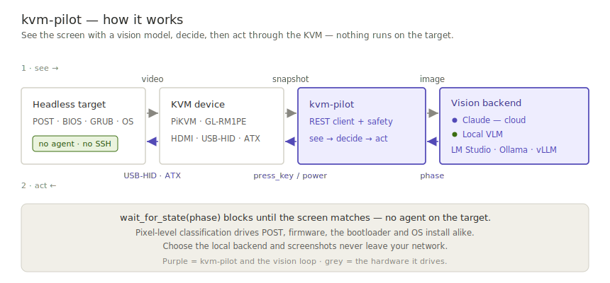
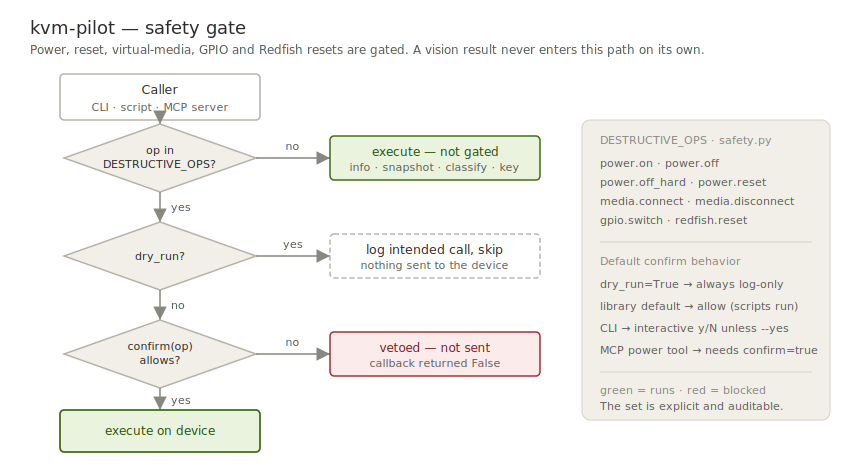

# kvm-pilot

**AI-driven bare-metal control for PiKVM and the GL.iNet GLKVM fork (GL-RM1 / GL-RM1PE).**

`kvm-pilot` is a stdlib-only Python client for the PiKVM REST API, a safety layer
that gates destructive power/media operations, and a pluggable vision subsystem
that reads a KVM screenshot and tells you what boot phase the machine is in —
`bios_menu`, `grub_menu`, `installer_progress`, `login_prompt`, `crash_screen`,
and so on. That last part is the point: it lets you drive a headless box through
POST, firmware, bootloader, and OS install **with no agent on the target**,
because the classifier works at the pixel level where there is no OS to cooperate.

Vision runs on Claude **or** any local OpenAI-compatible VLM (LM Studio, Ollama,
vLLM, llama.cpp). Point it at a model on your own GPU and the screenshots never
leave your network and cost nothing per frame.

> **Status:** v0.1.0a1 — **early alpha.** This code has **not been run against
> real hardware** — not even the GL-RM1PE it targets. It is unit-tested only
> (mocked HTTP and vision responses), so treat every feature as unverified,
> expect bugs and breaking API changes before 1.0, and don't point it at a
> machine you can't afford to have power-cycled unexpectedly. Hardware reports —
> success *or* failure — are exactly what this release is asking for; see
> [Compatibility](#compatibility).

---

## ⚠️ GLKVM users: enable the PiKVM API first

On GL.iNet firmware the PiKVM REST API is **disabled by default**. Until you
enable it, every `/api/*` call returns 404 and `kvm-pilot` cannot talk to the
device. To enable it, SSH into the unit (or use the app's terminal) and
uncomment the relevant block in:

```
/etc/kvmd/nginx-kvmd.conf
```

then restart the service (or reboot the unit). Note that a **firmware upgrade can
revert this**, so you may need to redo it after updates. This is a GL firmware
behavior, not a `kvm-pilot` setting. Stock PiKVM devices expose the API by
default and need no change.

`kvm-pilot` now **detects this condition**: select the GL driver and a 404 across
`/api/*` is surfaced as a clear, actionable `ApiDisabledError` (pointing you at
`nginx-kvmd.conf`) instead of a bare HTTP 404 — and you can preflight with
`check_api_enabled()`.

```python
from kvm_pilot import make_driver           # or: from kvm_pilot import GLKVMDriver

gl = make_driver("glkvm", host="192.168.8.1", passwd="…")   # GL-RM1 / GL-RM1PE
gl.check_api_enabled()        # raises ApiDisabledError with the fix if it's off
gl.get_firmware_info()        # {'version': …, 'model': 'GL-RM1PE', …}
gl.known_quirks()             # firmware-specific quirks we track
```

Pin it for the CLI / a profile with `--driver glkvm`, `KVM_PILOT_DRIVER=glkvm`, or
`driver = "glkvm"` in a config profile. (`PiKVMDriver` is the canonical base;
`GLKVMDriver` / `BliKVMDriver` are the fork subclasses. `KVMClient` remains an
alias of `PiKVMDriver`.)

---

## How it works

`kvm-pilot` runs a **see → decide → act** loop, and the screen is its only sensor:
it pulls a screenshot from the KVM, a vision model classifies the boot phase, and
`kvm-pilot` acts back through the KVM's keyboard and power. Because it works at the
pixel level, there is **no agent on the target** — the same loop drives POST,
firmware, the bootloader, and an OS install.



## Install

```bash
pip install kvm-pilot==0.1.0a1                 # core, zero runtime dependencies
pip install "kvm-pilot[totp]==0.1.0a1"         # + 2FA / TOTP support (pyotp)
pip install "kvm-pilot[ws]==0.1.0a1"           # + WebSocket event streaming
```

This release is **yanked on PyPI on purpose** — a deliberate "don't install me
unless you mean it" marker for untested alpha code. A plain
`pip install kvm-pilot` will therefore install **nothing**; opt in by pinning
the exact version as shown above. The core has **no third-party runtime
dependencies** — it is pure standard library. Extras are opt-in.

> **Heads-up: `0.1.0a1` is much older than this README.** It predates
> `make_driver` and the driver registry, the GLKVM/BliKVM/Redfish/fake drivers,
> `ApiDisabledError`, and the newer CLI (`capabilities`, `events`, `eject`,
> `--driver`, `--timeout`). To try what this page actually describes, install
> the current tree from git:
>
> ```bash
> pip install "kvm-pilot[totp,ws] @ git+https://github.com/DustinTrap/kvm-pilot"
> ```
>
> A `0.1.0a2` release covering all of the above is planned.

## Quickstart

```python
from kvm_pilot import KVMClient
from kvm_pilot.vision import ScreenAnalyzer, make_backend

kvm = KVMClient("192.168.8.1", "admin", "secret")

# Classify the current screen with Claude (model auto-resolved at runtime)
analyzer = ScreenAnalyzer(kvm, make_backend("anthropic"))
print(analyzer.classify().phase)

# Or run entirely on a local VLM — nothing leaves your network
local = make_backend("local", base_url="http://127.0.0.1:1234/v1", model="qwen2.5-vl-7b")
analyzer = ScreenAnalyzer(kvm, local)

# Block until the box reaches the GRUB menu, then pick the first entry
analyzer.wait_for_state("grub_menu", timeout=120)
kvm.press_key("Enter")
```

### CLI

```bash
kvm-pilot info     --host 192.168.8.1 --user admin --passwd secret
kvm-pilot capabilities --profile homelab                 # what this driver supports
kvm-pilot snapshot screen.jpg --profile homelab
kvm-pilot --timeout 60 power-cycle --profile homelab --dry-run   # log, don't send
kvm-pilot eject --profile homelab                        # detach virtual media
kvm-pilot events --profile homelab --count 5             # stream events ('ws' extra)
kvm-pilot watch grub_menu --profile homelab \
    --backend local --vision-url http://127.0.0.1:1234/v1 --vision-model qwen2.5-vl-7b
```

The CLI prompts for confirmation before any destructive action (power, virtual
media — including uploads — keyboard/mouse injection, GPIO). Use `--yes` to
skip prompts in automation, or `--dry-run` to log intended actions without
sending them — dry-run short-circuits *before* the prompt, so it never blocks
waiting for input. `--timeout` (HTTP per-request timeout) is a global flag and
goes *before* the subcommand; `watch` keeps its own `--timeout` for the vision
wait deadline.

Profiles like `homelab` live in `~/.config/kvm-pilot/config.toml`. See
[docs/configuration.md](docs/configuration.md) for the config-file format,
every `KVM_PILOT_*` environment variable, and the precedence between flags,
env, and profiles.

## Boot-phase detection

The vision classifier maps each screenshot to a **phase** — `bios_menu`,
`grub_menu`, `installer_progress`, `login_prompt`, `crash_screen`, and so on.
`wait_for_state()` polls the screen and blocks until the phase you asked for
appears (or a timeout fires), so an unattended install becomes a few waits with
actions wired between them:


## Sensing model

Vision is the most expensive way to read a screen — a model call per frame — and
most of what it infers (power state, boot phase, liveness, a crash) is also
available as a **field, an event, or a line of text**. The direction of
`kvm-pilot` is to treat classification as a hierarchy: answer from the cheapest
signal the device exposes, and fall through to OCR and finally a vision model
only when nothing cheaper can.


The PiKVM/GLKVM client already exposes the cheap end — ATX and HID LEDs,
video-signal and resolution, on-device OCR (`?ocr=true`), logs, Prometheus
metrics, and a WebSocket event stream. The [capability protocols](docs/architecture.md)
add `Logs`, `BootProgress`, `Sensors`, `SerialConsole`, and `Watchdog` as the
seam for BMC drivers (Redfish/IPMI), where the boot phase is a structured enum
(`BootProgress.LastState`) and the console is a serial text stream rather than
pixels. Different device classes are nearly complementary: capture devices are
strong on pixels, BMCs on structured state and serial text.

## Safety model

Power-offs, hard resets, virtual-media connect/disconnect and image uploads,
keyboard/mouse injection (`type_text`, `press_key`, shortcuts, clicks), GPIO,
and Redfish resets are classified as **destructive** and pass through a safety
layer:

- **dry-run** short-circuits *first*: it logs the intended call and skips it
  entirely — the confirm callback is never invoked, so dry runs never prompt
  or block.
- **confirmation** — a callback that can veto any destructive call that would
  really be sent. The library default allows everything (so plain scripts
  work); the CLI installs an interactive `y/N` prompt unless you pass `--yes`.



The destructive set is defined explicitly in `kvm_pilot.safety.DESTRUCTIVE_OPS`
so it is auditable rather than guessed. A vision classification can never
trigger a destructive action on its own — you wire that yourself, and the
safety layer still applies.

This software controls real hardware and can power-cycle or interrupt a running
machine. Read [SECURITY.md](docs/SECURITY.md) before exposing a KVM to the internet.

## No hard-coded model version

There is no model version string anywhere in the code. The Anthropic backend
resolves the newest vision-capable model at runtime via the Models API and
caches it; set `KVM_PILOT_VISION_MODEL` or pass `model=` to pin one. The local
backend uses whatever model you loaded on your server. Bring your own backend,
endpoint, and model.

## How this differs from other clients

[`pikvm-lib`](https://github.com/guanana/pikvm-lib) is a fine general-purpose
PiKVM client. `kvm-pilot` is aimed at a different job:

- **Vision-based boot-phase detection** — classify BIOS/GRUB/installer/crash
  states from screenshots, with blocking `wait_for_state` loops. This is the
  core feature and `pikvm-lib` has no equivalent.
- **Pluggable local or cloud VLM** — run inference on your own GPU at zero
  per-frame cost, or on Claude.
- **A safety layer** around destructive operations (dry-run + confirmation).
- **GLKVM-fork awareness** — documents the API-enable prerequisite and GL
  hardware quirks that bite GL-RM1PE users.
- **Zero runtime dependencies** in the core.

If you just want to script power and HID against a stock PiKVM and don't need
the vision layer, `pikvm-lib` may be the simpler choice.

On the BMC side, [sushy](https://opendev.org/openstack/sushy), DMTF's
[python-redfish-library](https://github.com/DMTF/python-redfish-library), and
[pyghmi](https://opendev.org/x/pyghmi) (IPMI) are mature, far more complete BMC
management SDKs — if you need account/firmware/network configuration,
EventService subscriptions, or hardware-proven maturity, use them. `kvm-pilot`
trades that completeness for one uniform capability surface across device
classes (IP-KVMs and BMCs behind the same protocols), the same safety layer
gating every destructive call, and the vision loop on devices that have pixels.

## Compatibility

| Device | Status |
|--------|--------|
| GL-RM1PE (Comet PoE) | Primary development target — **not yet hardware-tested** |
| GL-RM1 (Comet) | Expected to work (same firmware family); untested |
| PiKVM v3 / v4 | Expected to work (upstream API); untested |
| BliKVM | Expected to work (PiKVM-compatible API); untested |

**Nothing in this table has been verified on real hardware yet** — the entire
matrix is "expected to work" pending validation. ATX power control needs the
ATX adapter wired to the target's front-panel header: on the GL Comet family
(GL-RM1 / GL-RM1PE) that is GL.iNet's separately sold ATX board (GL-ATXPC),
while PiKVM v3/v4 kits include the ATX adapter in the box and BliKVM bundles
vary by model — check yours. Without ATX wiring, ATX calls return errors from
the device. Reports of success or failure on *any* hardware are exactly what
this alpha needs — please open a
[hardware report](https://github.com/DustinTrap/kvm-pilot/issues/new?template=hardware-report.yml).

## Architecture

`kvm-pilot` is moving to a modular, **driver-plugin** architecture so support can
expand to many KVM/BMC devices (PiKVM family, Redfish BMCs, JetKVM, …). Each
device implements only the capability protocols its hardware supports; the CLI,
safety layer, and vision subsystem stay device-agnostic. A `make_driver(kind)`
registry (mirroring `make_backend`) builds drivers by name, and a hardware-free
`FakeDriver` lets you exercise the whole loop — capabilities, safety gating, the
analyzer — with no device (`kvm-pilot capabilities --driver fake`). See
[docs/architecture.md](docs/architecture.md) for the design and diagram.

A **`RedfishDriver`** (`make_driver("redfish")`) speaks the DMTF Redfish API to
server BMCs — Dell iDRAC, HPE iLO, Supermicro, Lenovo XCC, OpenBMC — in one
stdlib-only client. It shows why capabilities are segmented: a BMC's set is
*complementary* to a PiKVM's (strong on structured state — power, boot phase,
sensors, logs, virtual media — with no keyboard/mouse/screenshot), and the driver
stays portable by following Redfish hypermedia rather than hard-coding vendor ids:

```python
from kvm_pilot.drivers import make_driver

bmc = make_driver("redfish", host="idrac.lan", user="root", passwd="…")
bmc.get_boot_progress()        # 'os_running'  — structured, no screenshot
bmc.read_sensors()["temperatures"]
bmc.power_off(wait=True)       # mapped to the target's actual ResetType, gated
```

It's on the CLI too — `kvm-pilot info --driver redfish --host idrac.lan …`.
Capability-specific subcommands a BMC can't serve (`type`, `snapshot`, `events`)
fail cleanly rather than crashing. Add `--redfish-auth basic` for an endpoint
without a SessionService (emulators, or a BMC with session auth disabled).

## Documentation

Full user and developer docs live in [`docs/`](docs/) (architecture, design
decisions, the Redfish reference, contributing, and the security policy). The
[project wiki](https://github.com/DustinTrap/kvm-pilot/wiki) is an
auto-generated, nicely formatted mirror of that folder.

## License

Apache License 2.0 — see [LICENSE](LICENSE) and [NOTICE](NOTICE). `kvm-pilot` is
independent and not affiliated with or endorsed by the PiKVM project, GL.iNet,
or Anthropic; those names are used only for compatibility description.
